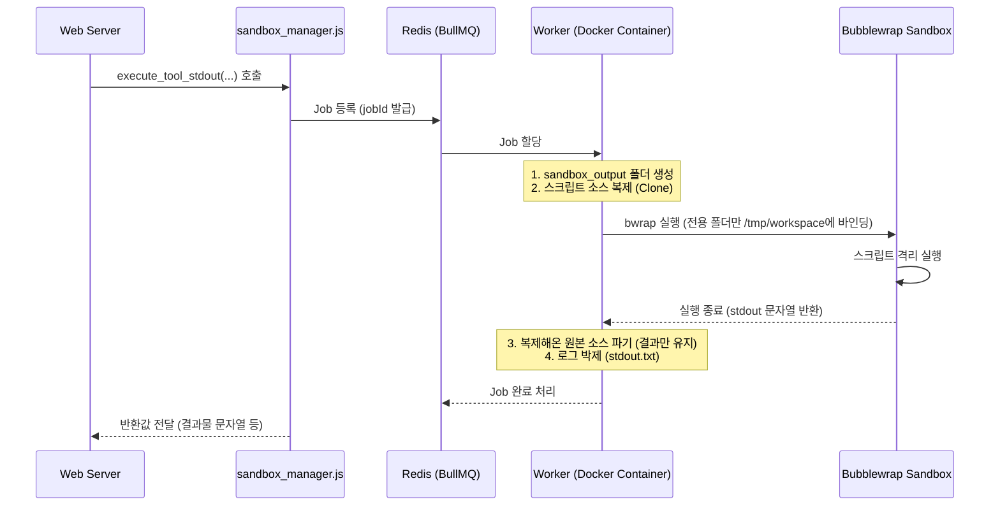

# 🏗️ Dynamic Plugin Sandbox Project

본 프로젝트는 외부에서 유입되는 플러그인(함수/스크립트) 코드를 **안전하고 완벽하게 고립된 샌드박스(Bubblewrap) 환경**에서 실행하고, 결과물을 세션별로 그룹화하여 제공하는 서버 엔진입니다.

본 프로젝트 루트에 위치한 **`api-server/sandbox_manager.js`** 모듈을 import하여 손쉽게 동적 샌드박스 파이프라인을 구축할 수 있습니다.

---

## 🎨 샌드박스 철학 및 아키텍처 Flow

본 시스템은 시스템 장애 방지 및 악성 코드 우회를 방지하기 위해 **3중 격리 구조**를 가지고 있습니다.
- **Layer 1 (Docker)**: 특정 플러그인 전용 런타임 이미지(웜풀)를 빌드하여 백그라운드 컨테이너(`worker-pluginName`)를 상시 띄웁니다.
- **Layer 2 (BullMQ)**: 단일 컨테이너 내부에서 동시에 최대 **5개**의 요청(Concurrency)을 큐잉하고 병렬로 처리하여 서버 리소스를 극대화합니다.
- **Layer 3 (bwrap Sandbox)**: 실제 스크립트가 실행될 때, 리눅스 `bubblewrap`을 호출하여 **네트워크 격리, PID 마스킹, 파일시스템 읽기 전용 모드** 등을 강제합니다.


### 서비스 구성 (Docker Compose)

| 서비스 | Dockerfile | 역할 | 인스턴스 |
|---|---|---|---|
| `api-server` | `api-server/Dockerfile` | HTTP API → 큐에 작업 등록 | 1 |
| `redis` | `redis:alpine` | 메시지 큐 (BullMQ 백엔드) | 1 |
| `worker-${PLUGIN1}` | 동적 생성 | `queue:${PLUGIN1}` 처리 (bwrap) | 1 |
| `worker-${PLUGIN2}` | 동적 생성 | `queue:${PLUGIN2}` 처리 (bwrap) | 1 |

> **Note**: 각 워커 컨테이너는 내부적으로 **5개의 동시성(Concurrency)** 설정이 되어 있어, 인스턴스가 1개라도 동시에 5개의 작업을 처리할 수 있습니다.


### 🔄 어떻게 다중 작업을 안전하게 동시에 실행하나요? (Isolation Mechanism)

본 프로젝트의 핵심은 **"단일 컨테이너 내에서의 다중 작업 격리"**입니다. 각 Job은 실행 시점에 물리적으로 분리된 디렉토리를 할당받습니다.

#### 1. 워크스페이스 동적 분리 (Dynamic Workspace Cloning)
작업이 할당되면 워커는 즉시 `sandbox_output/{session}_{plugin}/{jobId}` 폴더를 생성하고 원본 코드를 해당 폴더로 복제(Clone)합니다.

#### 2. 바인딩 격리 (Internal Binding)
`bwrap` 실행 시, 해당 전용 폴더를 샌드박스 내부의 `/tmp/workspace`로 바인딩합니다. 이로 인해 동일 컨테이너 내의 다른 작업 폴더를 절대 침범하거나 훔쳐볼 수 없게 됩니다.

#### 3. 실행 및 휘발성 관리
작업이 종료되면 복제했던 원본 소스 파일들만 즉시 삭제(Cleanup)하여, 결과물 폴더에는 오직 샌드박스가 생성한 결과 파일과 로그(`stdout.txt`)만 남게 됩니다.

```mermaid
graph TD
    subgraph "Docker Container (Worker)"
        Queue[BullMQ Worker - Concurrency: 5]
        
        subgraph CJ1 ["Concurrent Job 1"]
            Dir1["sandbox_output/.../Job1"] -- bind -- Bwrap1["Instance 1"]
        end
        
        subgraph CJ2 ["Concurrent Job 2"]
            Dir2["sandbox_output/.../Job2"] -- bind -- Bwrap2["Instance 2"]
        end
        
        subgraph CJN ["Concurrent Job N"]
            DirN["sandbox_output/.../JobN"] -- bind -- BwrapN["Instance N"]
        end
        
        Queue --> CJ1
        Queue --> CJ2
        Queue --> CJN
    end
```

---

### 🔄 실행 Flow 시퀀스

웹 서버가 `sandbox_manager`의 API를 호출했을 때 내부적으로 일어나는 동작입니다.



---

## 📁 샌드박스 결괏값 디렉토리 (Workspace)

스크립트 실행 시 생성되는 폴더와 결과물은 반드시 웹 서버 호스트의 **`sandbox_output/`** 폴더 규칙을 따릅니다.
동일한 세션이 호출한 작업끼리 직관적으로 그룹화되며, 실행 후 원본 스크립트는 삭제되고 오직 결과만 남습니다.

**구조 규칙:**
`sandbox_output/{플러그인명}_{세션ID}/{할당된JobID}/`

**결과물 예시:**
```text
sandbox_output/data-processor_user-session-123/
└── fb826818-9c08-41cb-aa61-6ed0deda839a/
    ├── stdout.txt               # 스크립트 실행의 표준 출력 (로그 박제용)
    ├── stderr.txt               # (에러 발생 시) 표준 에러 출력
    └── analysis_result.json     # (성공 시) 자식 스크립트가 마음대로 생성한 결과 파일들
```

---

## 💡 빠른 연동 예시 : `api-server/index.js`

웹 서버에서 매니저를 임포트하여 적용하는 가장 간단한 로직은 아래와 같습니다. 보다 상세한 로직은 본 프로젝트의 `api-server/index.js`를 뜯어보시면 명확하게 이해하실 수 있습니다.

```javascript
const { 
  build_image, 
  run_image, 
  execute_tool_stdout, 
  execute_tool_files 
} = require('./sandbox_manager.js');

async function handleUserRequest(userCode) {
  // 1. (웹서버 부트 도중) 사전 세팅: 플러그인 전용 이미지 빌드 및 상시 워커 구동
  await build_image({ pluginName: 'data-processor' });
  await run_image({ pluginName: 'data-processor' });

  // 2. (웹서버 API 엔드포인트 도달) 사용자 요청 처리 시작
  try {
    // 💡 Case A: 스크립트가 내뱉은 콘솔 문자열(stdout)만 바로 리턴받으려면?
    const resultText = await execute_tool_stdout({
      pluginName: 'data-processor',
      toolName: 'index.js',
      // sessionId: '로그인된-유저-DB-id', // 생략 시 UUID 임의 생성
      args: [userCode] // 스크립트 실행 인자 넘기기
    });
    console.log("텍스트 분석 완료:", resultText);

    // 💡 Case B: 스크립트가 무거운 분석 파일들을 내뱉고, 그 폴더의 경로만 얻고 싶다면?
    const absolutePath = await execute_tool_files({
      pluginName: 'data-processor',
      toolName: 'index.js'
    });
    console.log(`파일 처리가 완료되었습니다. 마운트 대상: ${absolutePath}`);

  } catch (error) {
    console.error("샌드박싱 중 치명적 오류:", error.message);
  }
}
```

---

## 📚 `sandbox_manager.js` 호출 가능 함수 상세 명세

모든 함수는 **비동기(`async/await` 혹은 `Promise`)**로 작동합니다.

### 1) 플러그인 별 컨테이너 셋업

#### `await build_image({ pluginName })`
플러그인 소스 폴더를 읽고, 해당하는 베이스 이미지를 조합하여 커스텀 런타임 이미지(`plugin-플러그인명`)를 빌드합니다.
- **인자 (`Object`)**:
  - `pluginName` (String): 대상 플러그인 디렉토리명 (ex: `"data-processor"`)
- **반환값**: `{ success: true, pluginName, language, image }`

#### `await run_image({ pluginName })`
`build_image`로 생성한 이미지를 백그라운드 Docker 컨테이너 워커로 올려, 상시 작업 대기 상태(`BullMQ Consumer`)로 만듭니다.
- **인자 (`Object`)**:
  - `pluginName` (String): 구동할 플러그인명
- **반환값**: `{ pluginName, container, image, status: 'running' }`

---

### 2) 샌드박스 작업 요청 (Execution)

실제 유저의 요청을 워커에게 위임하는 핵심 함수들입니다. (동시 처리 개수에 따라 최대 30초 대기)

#### `await execute_tool(options)`
샌드박스 실행 결과의 모든 로우(raw) 메타데이터를 담은 원형(Original) 객체를 반환합니다.

- **인자 (`options: Object`)**:
  - **`pluginName`** (String, 필수): 대상 플러그인
  - **`toolName`** (String, 필수): 실행할 스크립트 대상 파일 (ex: `"index.js"`)
  - **`sessionId`** (String, 선택): 사용자의 현재 세션을 식별하는 값. 미입력 시 시스템에서 난수(UUID) 자동 할당. 결과물을 폴더로 묶을 때 사용합니다.
  - **`args`** (Array, 선택): 스크립트를 호출할 때 넘겨줄 커맨드 인자 리스트 (ex: `['arg1', 'arg2']`)
  - **`timeout`** (Number, 선택): 작업 대기 최대 허용 시간(단위: 내부 ms). 기본값은 30000(30초).

- **반환값 (`Object`)**:
  - `sessionId`: 현재 작업 그룹
  - `jobId`: 해당 요청 전용 발급 고유 ID
  - `status`: 성공(`completed`) 또는 에러(`failed`)
  - `output`: 스크립트 샌드박스 내부의 터미널 표준 출력 (stdout)
  - `outputPath`: 파일을 만들었을 경우 해당 파일이 저장되어 있는 호스트의 **절대 경로 디렉토리** (ex: `/app/sandbox_output/data-processor_A/J1`)

#### `await execute_tool_stdout(options)`
`execute_tool`과 동일한 인자를 받지만, **실행 결과 문자열(stdout)** 만 간결하게 리턴하는 편의용 래퍼 함수입니다. 실패 시 예외를 `throw`합니다.

#### `await execute_tool_files(options)`
`execute_tool`과 동일한 인자를 받지만, **결과물이 쓰여진 폴더 경로(`outputPath`)** 만 간결하게 리턴하는 편의용 래퍼 함수입니다.
