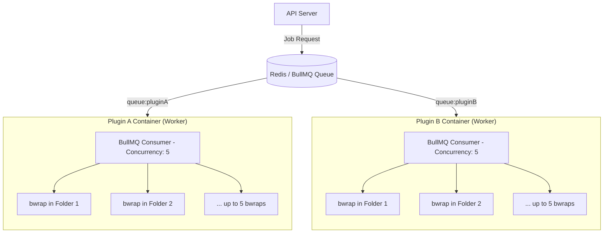
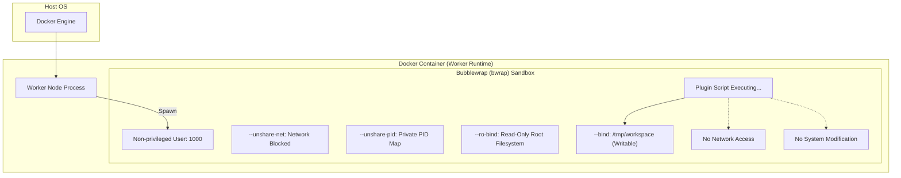
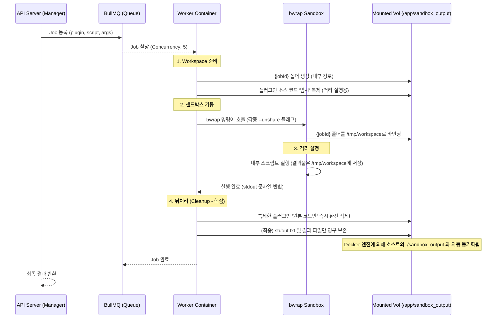

# 🛡️ 샌드박스 기반 이중 격리 아키텍처 (2-Layer Isolation)

본 문서는 `api-server` 엔진의 핵심 기술인 **Bubblewrap(bwrap)** 기반의 샌드박싱 메커니즘과 보안 격리 전략을 상세히 설명합니다.

---

## 🎨 이중 격리 전략 (2-Layer Isolation)

본 시스템은 악성 코드의 폭주와 시스템 우회를 완벽히 차단하기 위해 **Docker Container**와 **Bubblewrap Sandbox**로 구성된 강력한 **이중 격리 체계(2-Layer Isolation)**를 구현합니다.

### 🛡️ Active Isolation Layers
보호 대상인 **Host OS** 위에서, 시스템은 크게 두 가지 능동적인 격리 계층을 가집니다:
1. **Layer 1 (Docker Container)**: 리소스 제한(CPU/Memory) 및 Cgroups 네임스페이스 격리를 제공하여, 워커 컨테이너 전체의 물리적 폭주나 호스트와의 간섭을 1차적으로 방지합니다.
2. **Layer 2 (Bubblewrap/bwrap)**: 런타임 내부의 공격을 막는 2차 방어선입니다. 프로세스 권한을 완전히 박탈하고 커널 네임스페이스 수준에서 코드를 한 번 더 고립시킵니다. 네트워크를 원천 차단하고 시스템 전체를 읽기 전용으로 강제하며, 오직 지정된 폴더(`/tmp/workspace`)에만 접근하게 만듭니다.

### 🌐 샌드박스 전체 시스템 개괄 (High-Level Architecture)

`API Server`가 `BullMQ (Redis)`를 통해 작업을 위임하면, 큐에서는 각 플러그인별로 할당된 단일 **Docker 컨테이너(Worker)**로 작업을 라우팅합니다. 
각 워커 컨테이너 내부는 **동시성(Concurrency) 5**로 설정되어 있어, 동시에 들어온 여러 요청이 서로 간섭하지 않도록 **각각 물리적으로 다른 폴더에 격리된 채 `bwrap`을 통해 병렬 실행**됩니다.

---

### 🔄 샌드박스 내부 고립 메커니즘 (Deep Dive)

---

## 📁 샌드박스 실행 흐름 (Execution Flow)

API 매니저 모듈(`sandbox_manager`)을 통해 요청을 보냈을 때 워커 컨테이너 내부에서 일어나는 상세 시퀀스입니다.

---

## 🔒 bwrap 보안 정책 (Security Policy)

`worker-server` 내부에서 `bwrap`을 호출할 때 적용된 핵심 보안 플래그와 그 의미는 다음과 같습니다.

| 플래그 | 설명 | 보안 효과 |
|---|---|---|
| `--unshare-net` | 네트워크 네임스페이스 분리 | 아웃바운드/인바운드 네트워크 **원천 차단** (외부 C&C 서버 통신 불가) |
| `--unshare-pid` | 프로세스 ID 네임스페이스 분리 | 샌드박스 내부에서 외부 주요 프로세스(PID 1 등) 관찰 및 간섭 원천 불가능 |
| `--ro-bind / /` | 루트 전체 읽기 전용 바인딩 | 시스템 설정 파일 변조 및 실행 파일 덮어쓰기 등 파일시스템 훼손 방지 |
| `--bind DIR /tmp/workspace` | 특정 폴더만 쓰기 허용 | 정해진 작업 공간 외 어떤 곳에도 백도어 파일이나 잔여물 생성 불가 |
| `--uid/gid 1000` | 권한 강제 하락 (Rootless) | 프로세스가 컨테이너 내 관리자 권한을 탈취하려 해도 무용지물 (EUID 1000 고정) |
